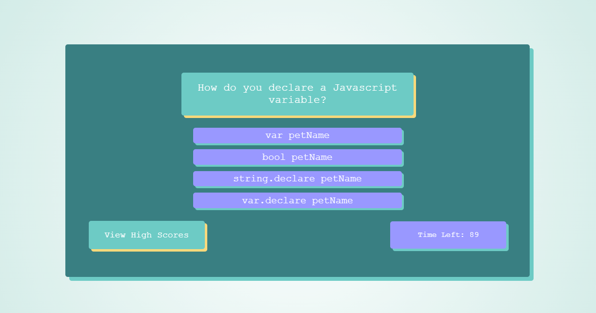

# Javascript Quiz

This project was to build a simple quiz game based on javascript questions using the js DOM API, localstorage, and more advanced javascript combined with nice looking CSS. 

The initial screen that loads has an option between "Start Quiz" and "View High Scores". The high scores page will be mostly empty unless you have already done the quiz and saved a high score.

When starting the quiz, you will be prompted with a question and four separate choices for answers. If you select the right answer, you are prompted with a new question. If you choose an incorrect answer, you get five seconds subtracted from your timer. The quiz ends when you have answered all the questions or you have run out of time.

Once the quiz has ended, the screen will change again, giving you options to start again, view the high scores, or submit and save your score with your initials to be considered along the high scores.

After high scores are saved, you can view them on the High Score screen, which sorts and shows the best scores on top.

Link to the finished product: https://old-prego.github.io/code-quiz/

